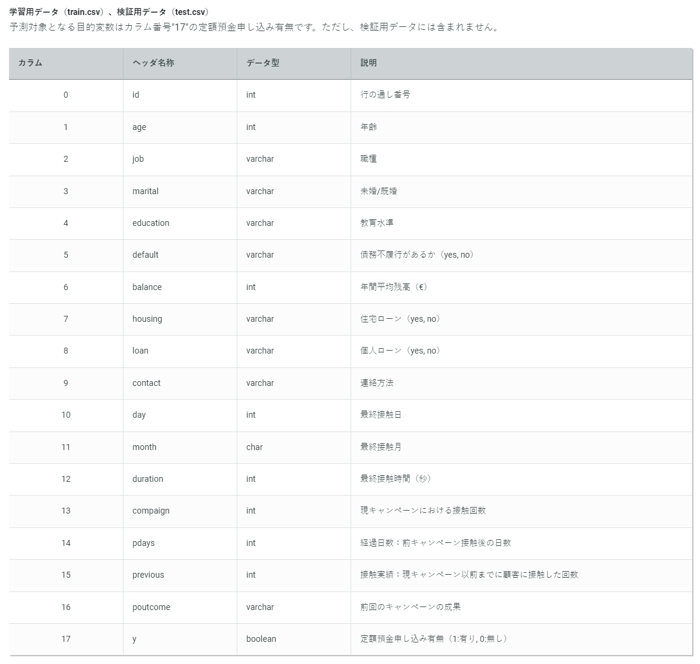

# MEMO

## python の開発環境に入る時に必要なコマンド

```sh
source env/bin/activate
```

# 【第40回_Beginner限定コンペ】銀行の顧客ターゲティング

顧客の属性情報などから定期預金キャンペーンの反応率を予測しよう。

## 今回のテーマ
顧客属性データおよび、過去のキャンペーンでの接触情報に基づいて口座を開設したかを予測するモデルの構築
※本テーマ設定は練習問題に掲載のタスクと同様ですが、データは異なるものを使用しております。

## データ

### 学習用データ (train.csv)
### テスト用データ (test.csv)

| |id|age|job|marital|education|default|balance|housing|loan|contact|day|month|duration|campaign|pdays|previous|poutcome|y|
|:----|:----|:----|:----|:----|:----|:----|:----|:----|:----|:----|:----|:----|:----|:----|:----|:----|:----|:----|
|0|0|31|services|married|secondary|no|12294|yes|no|cellular|21|nov|101|3|498|0|other|0|
|1|1|29|entrepreneur|single|tertiary|no|43027|no|no|cellular|22|aug|158|2|702|0|unknown|1|
|2|2|35|management|married|tertiary|no|12252|yes|no|cellular|11|nov|351|1|826|0|failure|0|
|3|3|31|technician|married|secondary|no|99121|yes|yes|unknown|16|may|658|2|120|0|failure|0|
|4|4|48|unemployed|married|primary|no|42005|yes|no|telephone|3|apr|177|1|273|0|unknown|0|

[変換ツール](https://markdown-convert.com/ja/tool/table)

```python
job = ['services' 'entrepreneur' 'management' 'technician' 'unemployed' 'blue-collar' 'admin.' 'retired' 'self-employed' 'housemaid' 'student']
marital = ['married' 'single' 'divorced']
education = ['secondary' 'tertiary' 'primary' 'unknown']
default = ['no' 'yes']
housing = ['yes' 'no']
loan = ['no' 'yes']
contact = ['cellular' 'unknown' 'telephone']
month = ['nov' 'aug' 'may' 'apr' 'sep' 'jun' 'jul' 'feb' 'oct' 'jan' 'mar']
poutcome = ['other' 'unknown' 'failure' 'success']
```



train.csvには $y$ の結果がない

[可視化のリンク](https://qiita.com/TaigoKuriyama/items/fccc5dd31326051d1d19) を見ながら異論値を可視化してみたり、検証してみたりしている。

```sh
27100 rows and 18 features in train set
18050 rows and 17 features in test set
```

欠損値は存在しなかった。


| |id|age|balance|day|duration|campaign|pdays|previous|y|
|:----|:----|:----|:----|:----|:----|:----|:----|:----|:----|
|count|27100.000000|27100.000000|27100.000000|27100.000000|27100.000000|27100.000000|27100.000000|27100.000000|27100.000000|
|mean|13549.500000|36.073284|47682.901771|16.747528|229.325387|1.775830|432.482399|0.085720|0.077934|
|std|7823.240484|7.816417|31650.760036|8.569529|204.939958|0.950045|252.150648|0.365889|0.268072|
|min|0.000000|22.000000|-6847.000000|1.000000|0.000000|1.000000|-1.000000|0.000000|0.000000|
|25%|6774.750000|31.000000|20015.750000|8.000000|121.000000|1.000000|214.000000|0.000000|0.000000|
|50%|13549.500000|33.000000|47624.000000|17.000000|158.000000|1.000000|432.000000|0.000000|0.000000|
|75%|20324.250000|37.000000|75330.000000|26.000000|345.000000|2.000000|650.000000|0.000000|0.000000|
|max|27099.000000|90.000000|102121.000000|31.000000|3076.000000|5.000000|870.000000|3.000000|1.000000|

- pdaysが負の値を取ることはあるのだろうか

### 投稿用ファイル (submit_sample.csv)

| |0|0.1|
|:----|:----|:----|
|0|1|0|
|1|2|0|
|2|3|0|
|3|4|0|
|4|5|0|

$1$ か $0$ かを出せばいいことを行っているだけのサンプル

# 日記

## 11/22

JOIN

kaggleスタートブックの最初の提出と同じようなものを作った。

ウエイトが偏っているものが多く、そのままだと全員が $0$ となってしまった。

それを改善するために ``balanced`` をしたけれど、今度は $1$ が過剰な量になってしまう。難しいね。

## 11/24

今日は[元問題のチュートリアル](https://signate.jp/competitions/1/tutorials/46)に挑戦してみる。

がむしゃらに試してみたけど、うまくいかない。やっぱりしっかり統計を取ったうえでやらないとうまくいかないことばかり。提出を潰しまくっちゃったので、今日はもう少し慎重にやってみよう。

チュートリアル本の続きの章を見てみる。

ていうか、提出しなくてもスコアが計算できるようなシステムを構築したい。

K-Foldというものがあるらしい。これを使えば、多少のスコアリングをすることが可能っぽい（本当はほかにメリットがあるっぽいんだけどね）。

### sub007 0.5075656776769024

``CV score: 0.9228617536309844`` ってあるんだけどこれは完全にウソつかれてる！？

次の提出まで10分待たなければならなくなってしまった（日付変更待ち）

## 11/25

日付が変わりました。評価手法が正答率だと勘違いしてました。``AUC`` っていう評価方法みたい。実際に ``CV score`` を出力している部分を見直してみたら、ちゃんと提出に近いスコアが出ました。

### sub008 0.7215746258729863

作った仕組みはうまく機能しているようだ。

```
CV score: 0.7349920143134512
```

下振れているが、誤差程度な気がする。

yes/noとの相関を取る図を作った。意外と使えそうな指標が多かったので、それらをデータに含めた。

```
CV score: 0.7725643721408056
```

思い切って全部使ってみる。

```
CV score: 0.8464308663310559
```

えっ

あとは軽微な特徴量の抽出で達成できそうだということに気づいた。

### sub009 評価結果：0.8406472773414975

おしいね

pdaysをよく見てみたら、-1が多いことはなかったので、あれは参考にならなかったのかも。

```
CV score: 0.8468731866245648
```

欠損値が欠損値であることを明示してみました

```
CV score: 0.845756095993465
```

微増。

最終接触時間が外れ値を取っているものは、なぜかみんな $3076$ とか、 $1579$ とか、デカい癖して固まっているので $NaN$ にしてみた。

```
CV score: 0.8463772948044641
```

ほんとにちょっとずつ前進している。


働いていないを主張してみた。

```
CV score: 0.8465753206625435
```

機械学習コンペってこういうのとの戦いなのか___？

よくよく見たら欠損値関連の要素入れてスコアが減ってる。とりあえずなかったことにする。

```
CV score: 0.8479249355311586
```

あがった。

### sub010 0.8434566903757706

いやー今日はもう浮かばなさそうだし寝よう。データ可視化の本を借りたから、そこにエッセンスがあることを信じよう。

おはようございます（午後五時）。

箱ひげ図を描いてみたりヒストグラムを描いてみたりしている。案外外れ値として考えた方がいい物ってのもあるもの。

60歳以上のデータがy=0しかなかったので、高齢者フラグを立ててみた。

```
CV score: 0.8479249355311586
```

durationに関しても、四分位範囲から大きく離れているものはあるけれども、多分分布を説明するのには使いにくそう。

lightGBMの演算時間を増やしてみた。

```
CV score: 0.8479575177001765
```

### sub011 0.8239396629653257

stopping_roundsを増やすと、過学習しちゃうだね。

target encodingを試してみる。

```
CV score: 0.8466459094593587
```

スコアは微減だが、「上昇しているケースもある」「過学習気味の数値を見ていた」から、何とかなると思って提出。

ついでにハイパーパラメーターも調整した。

### sub012 0.8440537344450356

最高値であるが、目標には届いていない。

残りの気にするべき特徴量がもうわからない。

やるべきこと

- sub010のときの特徴量表現に戻る
- optunaを使った調整

# 11/27

おはようございます。イカをしている間に、ChatGPTと対話をして得られた情報がいくつかあった。

```
特徴量の洗練:

モデルに対する特徴の重要度を確認し、重要な特徴だけを残すか、または新しい特徴を生成することが考えられます。
特徴の組み合わせや交互作用を追加して、モデルがより複雑なパターンを捉えられるようにします。
Recursive Feature Elimination (RFE)などの手法を使用して、特徴の重要度を再評価することも考慮してください。
lightGBMで調整するべきパラメータ:

ハイパーパラメータの調整はモデルの性能向上に重要です。現在のパラメータに関しては、以下のような調整が考えられます：
num_leaves: より大きな値を試してみて、モデルがより複雑なパターンを学習できるかどうかを確認します。ただし、過学習には十分に注意してください。
max_bin: ビンの数を調整してみて、モデルの適合度を向上させられるか確認します。
learning_rate: より小さな学習率を試して、収束をよりゆっくり行うことで性能向上が見込まれるかもしれません。
アンサンブルモデルにふさわしいモデル:

アンサンブルモデルを構築する場合、異なる種類のモデルを組み合わせることが効果的です。例えば、Random Forest、Gradient Boosting、XGBoost、または異なるアルゴリズムを組み合わせてみてください。
不均衡なデータへの対処:

不均衡なデータの場合、以下のアプローチが考えられます：
サンプリング手法の利用（アンダーサンプリング、オーバーサンプリングなど）
クラスの重み付けの調整
適切な評価指標の選択（Precision、Recall、F1スコア、AUCなど）
LightGBMでのSHAP値やpartial dependence plotsの算出方法:

SHAP（SHapley Additive exPlanations）値は、モデルの各特徴が予測に対してどれだけ寄与しているかを示します。LightGBMでのSHAP値の算出には、shapライブラリを使用できます。例えば、shap.TreeExplainerを使用してSHAP値を計算できます。Partial Dependence Plots（PDP）は、ある特徴が変化するとモデルの予測がどのように変わるかを可視化するための手法です。これは、pdpboxなどのライブラリを使用して描画できます。
```

- shap値の算出
- アンダーサンプリング・オーバーサンプリング
- クラスの重み付けの調整
- アンサンブルモデル
- 特徴量の洗練

とりあえず上からやれることはやってみたい。

shapを使ってみた。housingが評価として非常に大きい役割を果たしていることが分かった。

monthがあまり役立ってないっぽい→すなわちdayも意味なさそうなので、順次消してみる。

0.83, 0.82を記録した。そんなことないみたいだ。

どうしようもないのでoptunaをしている。

その過程で、feature_fractionという物をみつけた

```
CV score: 0.8547131109557157
```

これは期待大だ。

### sub013 0.8483322419554334

もう色々な値をチューニングにかけて探してもらうしかないなぁ

33分かかってスコアが出てきた。

{'max_bin': 246,
 'num_leaves': 27,
 'feature_fraction': 0.41147373846921387,
 'bagging_frafction': 0.7108898882747046,
 'bagging_freq': 6
 }

 ```
 CV score: 0.852583678558059
 ```

 クロスバリデーションしたスコアは低いけど、ちょっと出してみよう

### sub014 0.8505966

Optunaを900分回して出た物を基に、パラメータを設定してみたものの

```
params = {
    'objective': 'binary',
    'max_bin': 198,
    'learning_rate': 0.013,
    'num_leaves': 31,
    'feature_fraction':0.4456261609502345,
    'bagging_fraction':0.9018636041074152,
    'bagging_freq':7,
}
```

 ```
 CV score: 0.8547954667054689
 ```

### sub015 0.8502365

パラメーターチューニングだけで行けそうな領域に見える

```
CV score: 0.8550319188358504
```

### sub016 0.8498791417225443

もうわけわからないね

パラメータ量が多くてチューニングできてない感がすごい。

# 11/28

こんばんは。今日はアンサンブルをしていきたい。

# 11/29

結局アンサンブルなどいろいろしてみたけれども、一番効果があったのは「特徴量の洗練」でした。

- durationの変更
- previousの2値化

を加えることでどうにかなった。